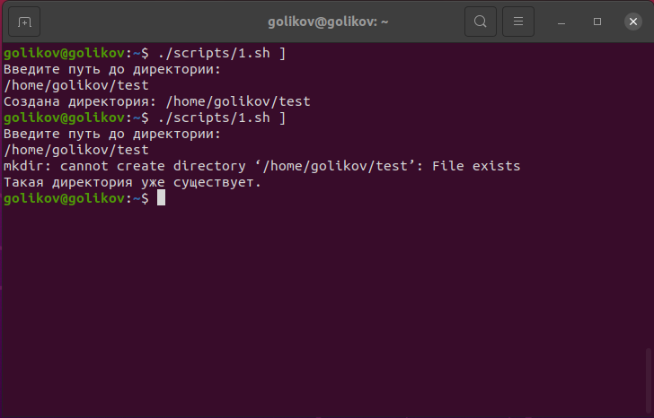
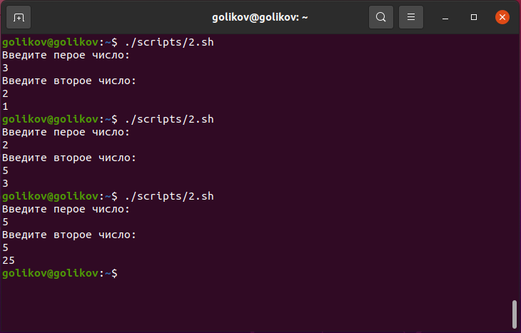
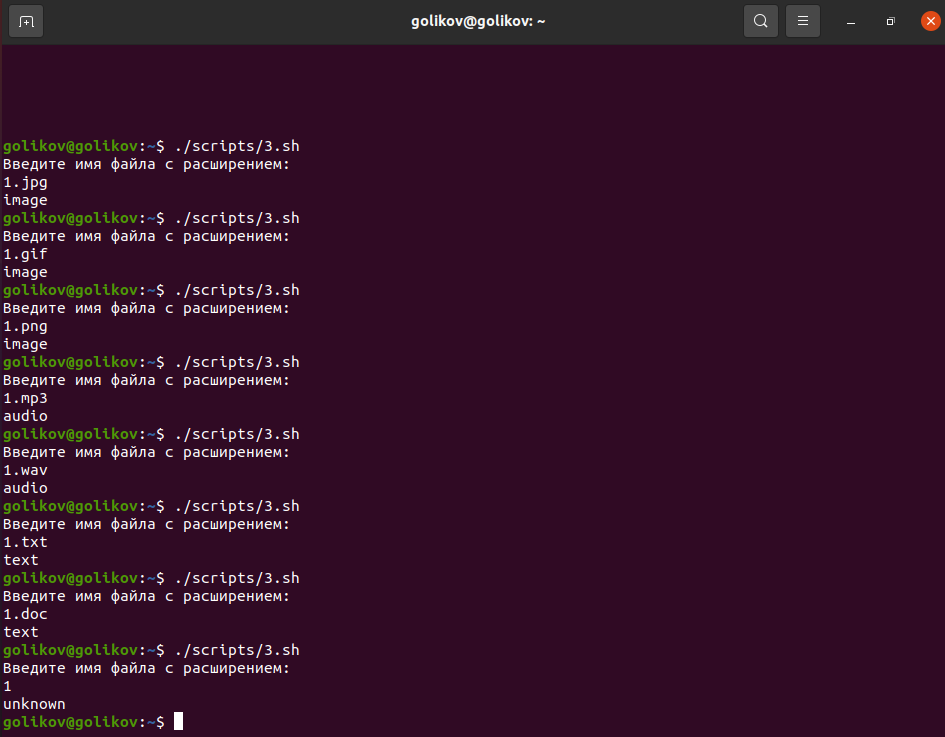

# Домашнее задание к занятию "5.1 Программирование на Bash : Переменные и условные операторы" 

------

### Задание 1.

Напишите скрипт, который при запуске спрашивает у пользователя путь до директории и создает ее при условии, что ее еще не существует. Если директория существует – пользователю выводится сообщение, что директория существует.
Скрипт должен принимать абсолютный путь до директории, например `/tmp/testdir` или `/home/user/testdir`

*Пришлите получившийся код и скриншот, показывающий работу скрипта в качестве ответа.*
```
#!/bin/bash
echo "Введите путь до директории:"
read dir
if mkdir $dir
then
echo "Создана директория $dir"
else
echo "Такая директория уже существует"
fi
```



------

### Задание 2.

Напишите скрипт:
1. При запуске скрипта пользователь вводит два числа.
2. Необходимо вычесть из большего числа меньшее и вывести результат в консоль.
3. Если числа равны – умножить их друг на друга (или возвести в квадрат одно из чисел) и вывести результат в консоль.

*Пришлите получившийся код и скриншот, показывающий работу скрипта в качестве ответа.*
```
#!/bin/bash
echo "Введите первое число:"
read a
echo "Введите второе число:"
read b
if (("$a">"$b"))
then
c=$(($a-$b))
echo $c
fi
if (("$a"<"$b"))
then
c=$(($b-$a))
echo $c
fi
if (("$a"=="$b"))
then
c=$(($a*$b))
echo $c
fi
```



------

### Задание 3.

Напишите скрипт с использованием оператора `case`:
1. При запуске скрипта пользователь вводит в консоль имя файла с расширением, например 123.jpg или track.mp3.
2. Необходимо сообщить пользователю тип файла.
- Если jpg, gif или png – вывести слово «image»
- Если mp3 или wav – вывести слово «audio»
- Если txt или doc – вывести слово «text»
- Если формат не подходит под заданные выше – написать «unknown»

*Пришлите получившийся код и скриншот, показывающий работу скрипта в качестве ответа.*

```
#!/bin/bash
echo "Введите имя файла с расширением:"
read a
case a in
(*.jpg|*.png|*.gif)
echo "image"
;;
(*.mp3|*.wav)
echo "audio"
;;
(*.txt|*.doc)
echo "text"
;;
(*)
echo "unknown"
esac
```



---
